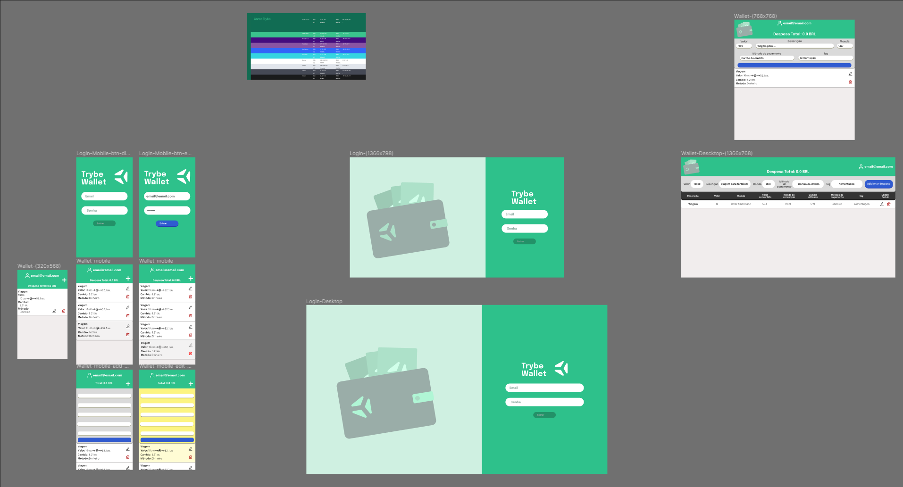
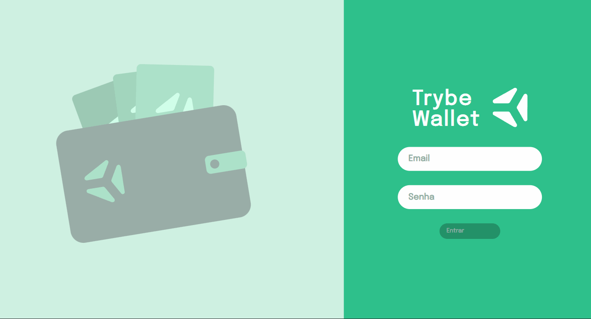
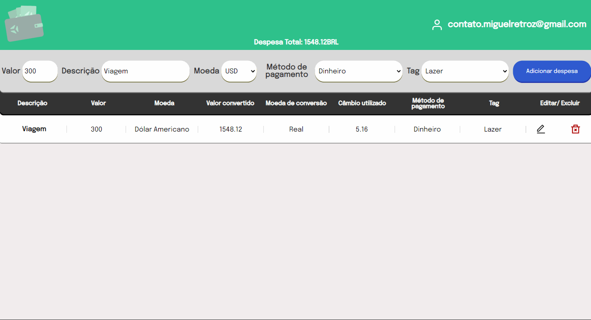
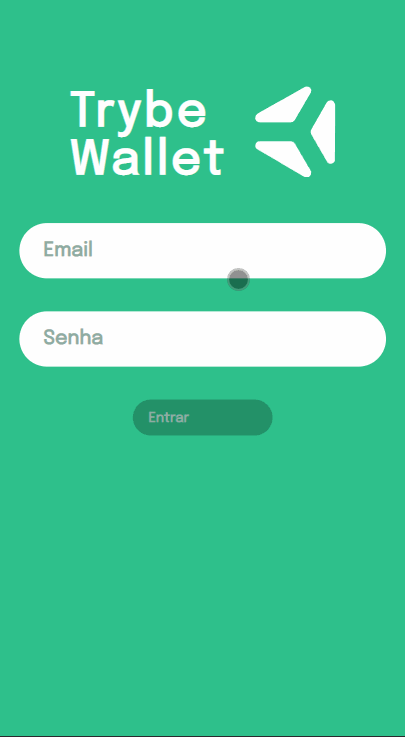
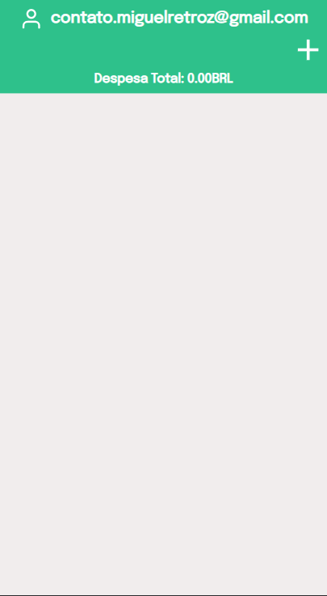

# <a href="#-trybe-wallet"></a> Trybe Wallet

> Projeto desenvolvido no curso da <a href="https://www.betrybe.com" >Trybe</a>

Carteira virtual com o foco na conversão de moedas, registro e controle de despesas.

Projeto construído 100% no Front-end, com tecnológias de front, sem um Back-end para persistência de dados.

A ideia era construir um CRUD com React e Redux, focando principalmente no uso do Redux para tratamento dos estados.

## 🛠️ Contruído com

🔹<a href="https://developer.mozilla.org/en-US/docs/Web/JavaScript">
  
    - JavaScript
</a>

🔹<a href="https://reactjs.org/">
    
     - React
  </a>

  🔹<a href="https://redux.js.org/">
    
    - Redux
  </a>

🔹<a href="https://developer.mozilla.org/en-US/docs/Web/CSS">
  
    - CSS
</a>

## <a href="#-layout"></a> Layout

O layout da aplicação foi desenvolvindo utilizando <a href="https://www.figma.com/">Figma</a>:

<a href="#-layout">
  
</a>

> O figma do projeto pode ser acessado pelo link abaixo

🔹<a href="https://www.figma.com/file/gnqt7Sp864YnWGtPJYFLw0/Trybe-Wallet?node-id=0%3A1">
  
    - Figma do projeto
</a>

Com foco na responsividade o layout foi todo construído baseado no conceito do *Mobile First*, ou seja, foi inicialmente desenvolvido para dispositivos com tela menores e depois para telas maiores.

<a href="#-layout">
  
</a>

> Responsividade página de login

<a href="#-layout">
  
</a>

> Responsividade página da carteira

## 🖱️Uso
> A aplicação pode ser acessada através do deploy realizado na plataforma gratuita do <a href="https://vercel.com/" >Vercel</a>:

🔹<a  href="https://miguel-retroz-trybe-wallet.vercel.app" target="_blank"> Vercel - Deploy da aplicação</a>

### 🔐 Página de login

A primeira página é a de login e para acessar a página da carteira baste realizar o login.

Como a aplicação não possue banco de dados e nem um back-end, não é feita nenhum autenticação ou verificação, basta inserir um email no formato válido *(Ex: email@email.com)* e uma senha com no mínimo 6 digitos.

<div align="center">
  <a href="#-página-de-login">
    
  </a>
</div>

### <a href="#-página-da-carteira"></a> Página da carteira

Na página da carteira é possível visualizar as despesas já existentes, adicionar uma nova, editar e remover.

<div align="center">
  <a href="#-página-da-carteira">
    
  </a>
</div>

## 🪛 Desenvolvimento
Basta realizar o clone do projeto, instalar das dependências:
```bash
npm install
```

E rodar:
```bash
npm start
```
para executar a aplicação.

### ⚙️Scripts
> O projeto possui três scripts principais. Para executá-los é necessário realizar a instalação das dependências com `npm install`

Para executar a aplicação:
```bash
npm start
```

Para executar o `ESLint` e realizar a análise estática do código **JavaScript**:
```bash
npm run lint
```

Para executar o `StyleLint` e realizar a análise estática do código **CSS**:
```bash
npm run lint:styles
```

## 👤Contatos
🔹<a href = "mailto:contato.miguelretroz@gmail.com" target="_blank">
  
  Gmail - contato.miguelretroz@gmail.com
</a>

🔹<a href="https://www.linkedin.com/in/miguelretroz/" target="_blank">
  
  Linkedin - Miguel Retroz
</a>

🔹<a href = "https://www.instagram.com/miguel_retroz/" target="_blank">
  
  Instagram - @miguel_retroz
</a>
